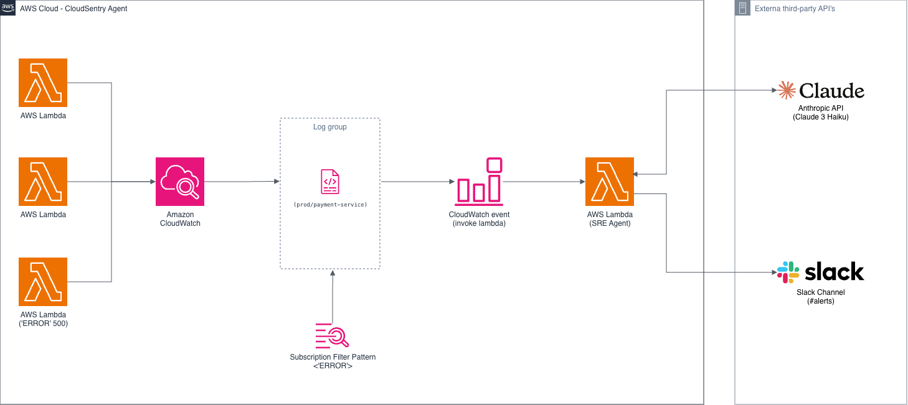

# CloudSentry AI: Intelligent & Automated Observability 🛡️🤖


**CloudSentry AI** is an autonomous, Serverless SRE (Site Reliability Engineering) agent designed to reduce **MTTR (Mean Time To Resolution)** for critical infrastructure incidents.

The system intercepts error logs in real-time from AWS CloudWatch, uses **Generative AI** to diagnose the root cause, and sends enriched notifications to **Slack** with actionable technical solutions.

---

## 🏗️ System Architecture

The project uses an **Event-Driven** architecture to minimize costs and latency.



[//]: # (```mermaid)

[//]: # (   graph TD)

[//]: # (%% Styles)

[//]: # (    classDef aws fill: #FF9900, stroke: #232F3E, stroke-width: 2px, color: white;)

[//]: # (    classDef ext fill: #2D3142, stroke: #333, stroke-width: 2px, color: white;)

[//]: # (    classDef slack fill: #4A154B, stroke: #333, stroke-width: 2px, color: white;)

[//]: # (    subgraph "AWS Cloud &#40;us-east-1&#41;")

[//]: # (        AppLogs["CloudWatch Log Group\n&#40;prod/payment-service&#41;"] -->|Subscription Filter\nPattern: 'ERROR'| Lambda["AWS Lambda\n&#40;SRE Agent Python&#41;"])

[//]: # (        class AppLogs aws)

[//]: # (        class Lambda aws)

[//]: # (    end)

[//]: # ()
[//]: # (    subgraph "External World")

[//]: # (        Lambda --> Anthropic["Anthropic API\n&#40;Claude 3 Haiku&#41;"])

[//]: # (        Anthropic --> Lambda)

[//]: # (        Lambda --> Slack["Slack Channel\n&#40;#alerts&#41;"])

[//]: # (        style Anthropic fill: #2D3142, color: white)

[//]: # (        style Slack fill: #4A154B, color: white)

[//]: # (    end)

[//]: # ()
[//]: # (%% Flow)

[//]: # (    linkStyle 0 stroke: #00ff00, stroke-width: 2px;)

[//]: # (    linkStyle 2 stroke: #ff0000, stroke-width: 2px;)

[//]: # (```)

## 🚀 Data Flow

1. **Detection:** A CloudWatch `Subscription Filter` monitors application logs for error patterns (e.g., ERROR, Exception, Critical).

2. **Processing:** An AWS Lambda function is triggered to decode the log (Gzip/Base64).

3. **Cognitive Analysis:** The Lambda sends the clean log to the `Anthropic (Claude 3)` API, requesting a root cause analysis and a technical solution.

4. **Notification:** The response is formatted using `Slack Block Kit` and sent to the operations channel.

## 🛠️ Tech Stack

| Component       | Technology          | Justification                                               |
|:----------------|:--------------------|:------------------------------------------------------------|
| Infrastructure  | AWS CDK (Python)    | Typed and modern Infrastructure as Code (IaC).              |
| Compute         | AWS Lambda          | Serverless execution (Pay-per-use).                         |
| AI Engine       | Claude 3 Haiku      | Fast, cost-effective model optimized for technical tasks.   |
| Observability   | AWS CloudWatch Logs | Native AWS log ingestion.                                   |
| Notifications   | Slack Webhooks      | Real-time alert delivery to the team.                       |
| Security        | python-dotenv       | Environment variable management (12-Factor App).            |

## ⚙️ Installation Guide

1. **Prerequisites**

    - AWS CLI configured (`aws configure`).
    - Node.js (for the CDK engine).
    - Python 3.9+.
    - Anthropic Account (API Key).
    - Incoming Slack Webhook.

2. **Environment Configuration**

    - This project uses environment variables for security.
    - Create a `.env` file in the root (based on `.env.example`):

       ```dotenv
       # .env
       AWS_ACCOUNT_ID=123456789012
       AWS_REGION=us-east-1
       ANTHROPIC_API_KEY=sk-ant-xxx...
       SLACK_WEBHOOK_URL=https://hooks.slack.com/services/xxx...
      ```

3. **Install Dependencies**
   ```bash
   # Create virtual environment
   python -m venv .venv
   source .venv/bin/activate  # Windows: .venv\Scripts\activate
   
   # Install libraries
   pip install -r requirements.txt
   ```

4. **Deploy**
   ```bash
   # Synthesize CloudFormation template
   cdk synth
   
   # Deploy to AWS
   cdk deploy
   ```

## 🧪 How to Test (Error Simulation)

   - To validate the system without breaking the real application, we will inject a test log:

1. Go to the AWS Console -> CloudWatch -> Log groups.
2. Enter the group: `/prod/payment-service`.
3. Create a Log Stream (any name).
4. Create a Log Event with the following message:

   ```text
   2026-01-12 10:00:00 ERROR [Database] Connection refused at port 5432. 
   Caused by: FATAL: password authentication failed for user "admin"
   ```

5. Check your Slack. You should receive a card with the diagnosis and suggested solution within seconds.

## 📂 Project Structure

   ```text
   cloudsentry-ai/
   ├── app.py                      # CDK Entry Point
   ├── .env                        # Variables (Ignored by git)
   ├── cdk.json                    # CDK Configuration
   ├── requirements.txt            # Python Dependencies
   ├── cloudsentry_ai/
   │   └── cloudsentry_ai_stack.py # Infrastructure (Lambda + Logs)
   └── lambda/
       └── agent.py                # Agent Logic (AI + Slack)
   ```
